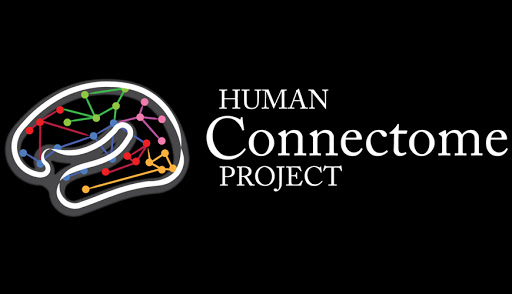

# Instructions to download data from the Human Conectomme database - Jonathan
 
Team contributors: Jonathan Gallego, Brainhack School

## This files describes the required steps for downloading data from the HCP database

- The first step is to access the HCP database website (https://db.humanconnectome.org/) and create an account in order to be able to access to the data

- Many useful resources on the organization of the HCP database can be found in https://www.humanconnectome.org/connectomeDB/help/

- After creating an account and loggin in, go to the WU-Minn HCP data 1200 subjects release and click the dropdown menu to select the MEG subjects

- This will open a new tab showing a list of the HCP subject that have MEG data

- For this project, we used a small subsample of 12 subjects from this release, including the first 6 male and 6 female subjects that had all the desired data available (unprocessed MEG, processed MEG, MEG anatomy, MRI structural data, preprocessed fMRI data). 

- The subjects used for this project were:

- 100307, 102816, 105923, 106521, 108323, 109123, 111514, 112920, 113922, 116524, 116726, 133019

- To download the data from one subject, click on the id to access the subject folder, then click on the Download images button on the right side of the screen

- Click on the "+" icon next to the derivables you want to download them to add them to the cue

- After selecting your files click on the Download Packages button

- You will be prompted to install the Aspera Connect plugin in your browser in order to download the data. Install and activate the plugin on the extensions menu from your browser settings

- Once you finished downloading all the data, you will need to extract the files to access the content
