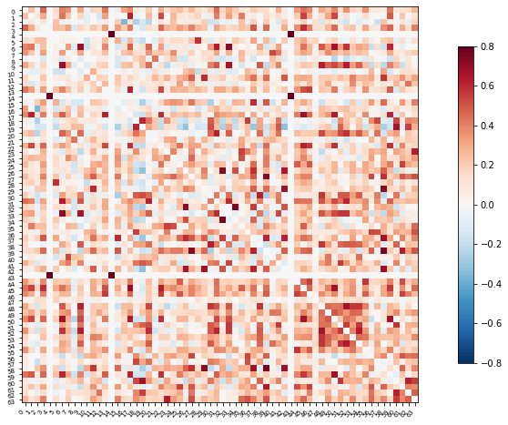

# Visualization of functional connectivity from multimodal neuroimaging data - Jonathan
 
Team contributors: Jonathan Gallego, Brainhack School

## Summary 

Hi!, I'm a first year PhD student at McGill. My BHS project aims to use some of the visualization tools we have learned for displaying functional connectivity results from both MEG and fMRI data.
I'm planning  to use data from the Human Connectome Project (https://www.humanconnectome.org).
I would love to hear from other people projects, and if we have similar interests we could team up!
twitter: @jogaru1818

## Project definition

### Background

- Although MEG and fMRI are very different signals, they both reflect some aspects of neuronal activity

- Functional connectivity assess the statistical dependence between the activity (time-series) of different brain regions

- After preprocessing the data individually, we can have both modalities in the same coordinate space, parcellate the brain according to a common atlas and extract the MEG and fMRI time-series of each brain region.

- We then could compute some connectivity measures and try to visualize the results from both modalities in parallel!

### Tools 

- Human Connectomme Dataset: As the Open data repository from which I will obtain the data form my BHS project

- GitHub: To create a repository compiling all the resources employed for this project.

- Python: To explore data visualization and analysis tools to use on multimodal functional connectivity data.

- Jupyter notebook: To document the code used to organize, manage and analyze the data. 

### Data 

I will be using data from 10 ?? sample subjects from the Human Connectome Project, including:

- Preprocessed high resolution anatomical MR scan

- Preprocessed fMRI resting state data (sesion 1)

- Unprocessed MEG resting state data

- Unprocessed MEG noise recordings

- Anatomical info for MEG registration.

### A brief example of what I mean...

Already dowloaded and started exploring some data

Hands on the MEG data in a familiar environment (Brainstorm)

After registering the sensors to the structural MRI, preprocessing MEG, taking tha data to source space and extracting the time-series of each brain region from the Desillan Killany atlas (68 ROIs)... Here is an example of how the connectivity (correlation) matrix of a single HCP subject look like:

After following the corresponding steps with fMRI, we could also obtain a correlation connectivity matrix, as the one we saw in last week demonstration

And now what? Since we have summarized our data into two simple matrices with the same dimesions we could develop some fancy visualization tools to explore the information provided by each modality, or even to make comparisons between modalities!

### What I want to learn

- To manage and analyze data in Python 

- Use some tools for neuroimaging analysis (such as nilearn)

- Try different visualization libraries 

- "Live the experience" of collaborating with others through GitHub

### Deliverables

A set of jupyter notebooks containing code to implement tools for visualization of functional connectivity results that apply to both modalities

## Results 

### Progress overview

### Tools I learned during this project
 
### Results 

#### Deliverable 1: report template

#### Deliverable 2: project gallery
 
## Conclusion and acknowledgement

The BHS team hope you will find this template helpful in documenting your project. Developping this template was a group effort, and benefitted from the feedback and ideas of all BHS students over the years.
